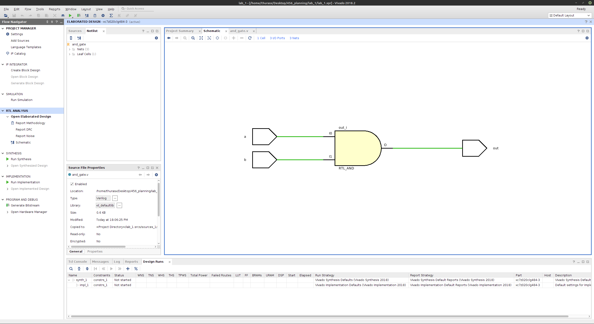
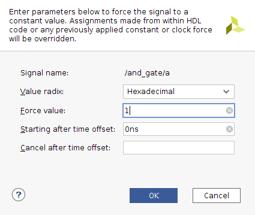

# Lab01 - Introduction to Vivado and Gate Simulation (lab01_gates)
Important Notes:
1. Name your files as specified in the lab directions for best results.
2. First thing add your name, date, assignment number etc. in the comment block at the beginning.
   This is the first thing that makes it clear it is your code. Also helps with grading.
3. Take screenshots as you go and save them to a properly labeled folder.
4. It may be easier to turn in the verilog as a screen capture also to maintain the legibility and formatting.

# Submission Details
Today's lab will be a pdf report submitted to Canvas. Ideally you will submit 4 sets of verilog, a schematic and
a timing diagram for 4 basic gates. Today's lab will be graded as follows:
1. (2 pts) Formatting with team names on top right hand side with title of assignment immediately underneath and all
   right justified. Each gate having a clearly labeled section, with the verilog, schematic and timing neatly placed and labeled
   within the section.
3. (5 pts) `AND` gate section label, verilog, schematic and all possibilities timing diagram
4. (1 pt) `OR` gate section label, verilog, schematic and all possibilities timing diagram
5. (1 pt) `XOR` gate section label, verilog, schematic and all possibilities timing diagram
6. (1 pt) `NOT` gate section label, verilog, schematic and all possibilities timing diagram
   
# Learning outcomes
1. Familiarity with Vivado project creation and simulation
2. Reinforcement of basic gate logic and timing diagrams

# Project creation
Start the project
1. Use the Windows key to bring up the search bar for Vivado.
2. Start Vivado.
3. Under Quick Start, choose Create Project.
4. Hit Next to use the assist at creating projects (Wizard).
5. Fill in the project name (lab01_gates) and file location.
6. Default is rtl project, which is what you want so just click Next.
7. Don't create a new file yet, just click Next.
8. No constraint file yet, so just click Next again.
9. Select the `Board` tab. Under `Name` find PYNQ-Z1.
10. Select PYNQ-Z1 in table below. Make sure that the Part is xc7z020clg400-1 or it may cause problems later.
    (Specifically, not being able to find certain inputs and outputs when translated to the board.)
12. Choose Finish.

# Editing file
1. In the middle Sources window choose the plus tab.
2. Choose add or create design sources. Click Next.
4. Create new file by choosing the plus tab again, -> Create File. Name it `and_gate'. Click Finish
5. In the future you can specify parameters to your Module here, but for now lets make sure 
   to learn the whole structure of a Verilog program so you can write it yourself. Just click OK.
6. Click Yes.
7. Now you will notice in the Sources Window under Design Sources that the and_gate file has been created.
8. Double click on the file and it will open a window on the right side.
9. Fill in the team member names under Engineer. As well as the other pertinent information.
    
Create the `AND`  gate by typing in the Verilog below. Note that this module is not really necessary, but this is a learning experience. The and gate specification within the verilog module, and(out, a, b), is an example of structural verilog.

<!--    ## Format -->
 <!--    *gate*(*output*, *input1*, *input2*) -->

```verilog
//Example AND gate
module and_gate(
    input a, 
    input b, 
    output out
);
and(out, a, b);
endmodule
```

# Viewing the schematic
RTL Analysis -> Open Elaborated Design 


    
# Simulation
1. `Run simulation` -> `Run behavioral simulation`
2. Use the tcl (the command line) commands or UI (user interface) buttons to run the simulation. tcl commands are listed below to run the simulation.
3. When launching the simulation, all the signals will be in a high impedence state or `Z` and outputs will be `X`.
4. To start the simulation from 0 timestep, type in `restart` in tcl or use the circle arrow icon (looks like a reload page icon) in the top menu on the far right.
5. Force a constant value on an input line (signal)

    1) Select the signal -> right click -> force constant -> force value -> 1
   
   

   

    2) tcl console -> add_force *input name* {value timestep}
        
       ``` verilog 
        add_force {/and_gate/a} -radix hex {1 0ns} 
        ```
       To type into the command line, you will need to type into the dialog box underneath the Tcl Conslol Window.
6. Step into timestep to see the wave form (timing diagram) of the signal
   
   1) The play button with a subscript "T" adds the additional runtime specified in the box immediately to its right. Specify the time to step to next wave
   2) type into tcl console
    ```verilog
        run 10ns
    ```

7. Restart the simulation 
   1) The circle arrow  button will reset and rerun the simulation.
   2) Type into tcl console
   ```verilog 
        restart
   ```

8. Inspecting wave form (timing diagram)
   1) Use the magnifying glass in the User Interface, the three icons to the right of the disk icon in the waveform window.
   2) Apparently zooming in and out is no longer supported on the command line

9. See below for a set of commands to test an `OR` gate, a similar set of tcl commands can be used to test an `AND` gate.
    
10. Once you have a timing diagram of all possible input and output combinations of an `AND` gate, ask the TA or instructor to view your diagram. They will ask you a few "check-off" questions. 
11. Take a screen shot of the circuit and the timing diagram for your lab report. You will submit a lab report to Canvas as a pdf. For today's lab that will simply be a header with Lab 01 - Gates, section labels for each gate and diagram, then on the top right hand side should be the names of the lab partners.
12. A lab report with only the `AND` gate screen shots and reasonable formatting will be 60%.
    Try to also simulate `OR`, `XOR` and `NOT` and take verilog, circuit and timing diagram screen shots. 
14. Implement each of the additional gates in its own module. To simulate a different module make sure to make it the "Top" by right clicking on the filename under Design Sources and then choosing 'Set as Top'. Then do the same thing with the corresponding file under simulation. Future simulations will now use the new file.

## Automated simulation scripts (TCL commands)

You can also write a series of TCL commands in a text editor. Then, you can copy all TCL commands and paste them in the `tcl console`. That way you can make the simulation faster and in organized manner. Here is a tcl command to simulate the `OR gate`
```verilog
// OR gate
add_force {/or_gate/a} -radix hex {1 0ns}
add_force {/or_gate/b} -radix hex {0 0ns}
run 10ns
add_force {/or_gate/a} -radix hex {1 0ns}
add_force {/or_gate/b} -radix hex {1 0ns}
run 10ns
add_force {/or_gate/a} -radix hex {0 0ns}
add_force {/or_gate/b} -radix hex {1 0ns}
run 10ns
add_force {/or_gate/a} -radix hex {0 0ns}
add_force {/or_gate/b} -radix hex {0 0ns}
run 10ns


```
