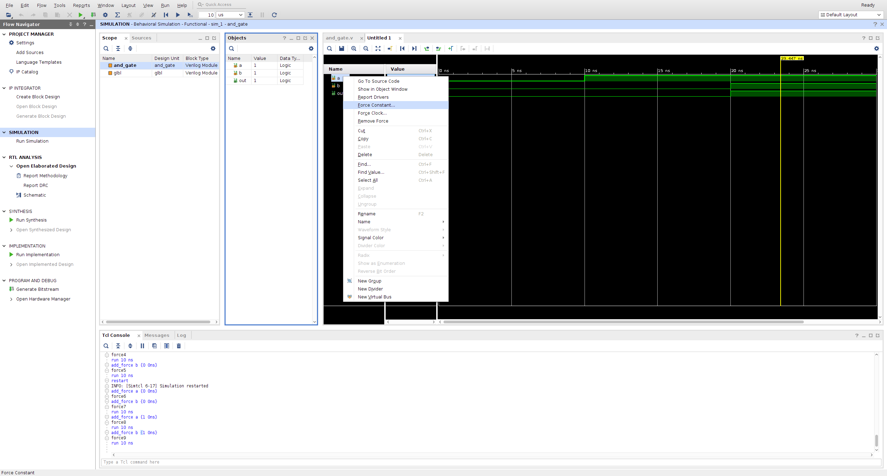

# Lab02 - Simulation review and Board testing (lab02_board_demo)
Important Notes:
1. Name your files as specified in the lab directions for best results.
2. First thing add your name, date, assignment number etc. in the comment block at the beginning.
   This is the first thing that makes it clear it is your code. Also helps with grading.
3. Take screenshots as you go and save them to a properly labeled folder.
4. It may be easier to turn in the verilog as a screen capture also to maintain the legibility and formatting.

# Submission Details
Today's lab will be a pdf report submitted to Canvas. Ideally you will submit your modified verilog, a schematic,
a timing diagram that tests all four gates, and a picture of your board with a person pressing the buttons and
showing the correct output for all gates for one set of inputs. 
Today's lab will be graded as follows:
1. (2 pts) Formatting with team names on top right hand side with title of assignment
    immediately underneath and all right justified. Each picture clearly labeled.
2. (2 pt) Verilog with header and names for all the gates connected to the board.
3. (2 pt) Schematic corresponding to the verilog for all gates connected to board inputs and outputs.
4. (2 pt) Timing diagrams (4) of testing the circuit at all possible input combinations.
5. (2 pts) Board picture(s) at the end with correct LEDs lighting for switch position.
   
# Learning outcomes
1. Increasing familiarity with Vivado project creation, simulation, and downloading to the board.
2. Reinforcement of basic gate logic and timing diagrams.
3. Demonstration of exercising circuit on the board.

# Project creation
Start the project
1. Use the Windows key to bring up the search bar for Vivado.
2. Start Vivado.
3. Under Quick Start, choose Create Project.
4. Hit Next to use the assist at creating projects (Wizard).
5. Fill in the project name (lab02_board_demo) and file location.
6. Default is rtl project, which is what you want so just click Next.
7. Select the `Board` tab. Under `Name` find PYNQ-Z1.
8. Select PYNQ-Z1 in table below. Make sure that the Part is xc7z020clg400-1 or it may cause problems later.
    Specifically, not being able to find certain inputs and outputs(a missing package pin error)
    when translated to the board. You should be able to change to the correct part by going to `Settings`
    under the Project Manager, then choosing `General` under Project Settings on the left. On the right under
    project device you can use the '...' to change the device.
9. Choose Next, then Finish.

# Editing file
1. In the middle Sources window choose the plus tab.
2. Choose add or create design sources. Click Next.
4. Create new file by choosing the plus tab again, -> Create File. Name it `board_demo'. Click OK, then Finish.
5. In the future you can specify parameters to your Module here, but for now lets make sure 
   to learn the whole structure of a Verilog program so you can write it yourself. Just click OK.
6. Click Yes.
7. Now you will notice in the Sources Window under Design Sources that the board_demo.v file has been created.
8. Double click on the file and it will open a window on the right side.
9. Fill in the team member names under Engineer. As well as the other pertinent information.
    
Create an initial design by typing in the Verilog below. Note that this module is taking inputs from outside of the
fpga. We will learn more about the signals specified today. For now, make sure your spelling and capitalization is
exact. Note: this is still structural verilog.

```verilog
// Testing the board LEDS and set up
module board_demo(
    input [1:0] SWITCHES, 
    output [3:0] LEDS
);
    and(LEDS[0], SWITCHES[0], SWITCHES[1]);

endmodule
```

# Viewing the schematic
RTL Analysis -> Open Elaborated Design -> OK

Make sure that your schematic makes sense. It should look something like the picture below.


# Continue creating design
Use the and gate as an example and add an or, xor, and not gate each with the same inputs, but the output
should be increasing LEDS. Since the not gate has only one input, use the SWITCHES[0] only.

Again check your schematic. If you are having trouble getting your schematic to update, right-click on 
Open Elaborated Design and choose Reload.
    
# Simulation
First, use the graphical methods of running a simulation, then use the command line (tcl) console.
1. `Run simulation` -> `Run behavioral simulation`
2. When launching the simulation, all the signals will be in a high impedence state or `Z` and outputs will be `X`.
3. To start the simulation from 0 timestep, type use the circle arrow icon (looks like a reload
    page icon) in the very top menu on the far right.
5. Force a constant value on an input line (signal)
   To force a particular signal line it is best at the beginning to expand each set of signals
   using the drop down arrow next to the signal on the left (like opening a directory/folder).
   
   Select and individual signal line -> right click -> force constant -> force value -> 1
   
   

   

Note(s): All individual signal lines will need to be forced to get a valid timing diagram.

6. Use the play button with a subscript "T" in the menu at the very top to see the wave form
   (aka timing diagram). The box immediately to the right specifies the additional runtime.
   Specify the time to run, I used 10 ns which is the default, and then tried using ps, which
   sometimes had a nicer output.

8. Restart the simulation the circle arrow  button will reset and rerun the simulation.

9. Inspecting wave form (timing diagram)
Use the magnifying glass in the User Interface, the three icons to the right of the disk icon in the
waveform window to find the best "view". Play with the menu icons above the timing diagram to zoom in, out,
move to the next rising edge or falling edge, and to the beginning or end of the waveform.
Note that you can "test" all of the outputs at once with these particular forced input as these gates 
are set up in parallel. 

Once you have a timing diagram with one set of forced inputs that is correct, take a screenshot
and move on to the other possible combinations for a total of four. You might want to use the command line
(tcl) console to do the other examples. The related tcl commands are shown below.

### TCL commands
   ```verilog
        restart
        add_force {/board_demo/SWITCHES[1]} -radix hex {0 0ns}
        add_force {/board_demo/SWITCHES[0]} -radix hex {0 0ns}
        run 10ns
   ```
Note that next week we will learn about testbench files with will allow you to have a program to run
for a simulation. This is just a "quick test" process until we learn about testbenches.

### Setting up a constraints file
Download the constraints file at https://github.com/cs456s25/labs/blob/main/lab02/PYNQ-Z1_C.xdc 
To add the constraints file go to the Sources tab -> Constraints -> constrs_1 then choose +
Add or create constraints should be selected. Click Next.
Click on Add Files. Then navigate to where you downloaded the file from above and select it.
Choose OK and then Finish.

Go back to the Sources tab and open the PYNQ-Z1_C.xdc file. You will need to edit it.
Uncomment a total of six line. The two with SWITCHES in them and then the four corresponding 
to LEDS[0-3]. Save.

### Get the equipment suitcase from a locker. 
See the instructor for a locker number and combination. 
You will only need the container with the pink stryrofoam and the PYNQ board. Leave the other cables alone.

### Programming the board
1. Plug in the board by using the USB cord and plugging the USB side into any USB port on the back of the computer.
    Then slide the other end into the appropriate connector on the PYNQ board, right above the words PROG UART.
   Power on the PYNQ board with the power switch on the bottom left. A red light should come on.
3. Choose generate bitstream from under the Program and Debug menu on the left. Accept the defaults and click OK.
   This takes some time. You can see the system working by the spinning green circle in the top right. Just wait.
   Click OK.
5. Open Target. You should now be able to choose Open Target under the Open Hardware Menu on the left.
   Choose Open Target and Auto Connect. After a bit you should be able to choose Program Device.
7. Program Device. When you click on Program Device, the part xc7z020_1 will pop up. Choose it. Accept defaults and click Program.
8. The LEDS should now be lit up for a one output and not lit for a zero output based on the values of the SWITCHES.
Take a picture or two of the board working with a variety of switch combinations. Try to get all four possibilities.

Once you are done, power off the board before disconnecting it and putting it away.


