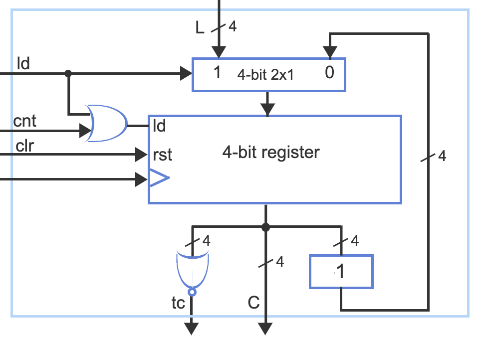

# Lab06 Register with Load and Reset in an UpCounter
This lab incorporates what you have learned with combinationa and sequention circuits to create counters
with the experience and reading on verilog to create a 4-bit upcounter with a load and reset. The best approach
is to create a one-bit register with the same inputs as the register in the diagram below, then create a 4-bit register
to use in a top-level module. As shown in the zyBook, you will also need to create a 4-bit OR gate and use the adder from
prior labs or create a new one. You will be most successful if you use behavioral verilog to create the individual modules,
but then use structural verilog to connect those modules in the top module.

You do not need to use the boards today.

## Submission
Submit a pdf with the following schematics and related timing diagrams
with appropriate formatting as in past labs. (Names, assignment, section titles etc.)

More specifically:
1) (4 pts) verilog code, schematic and timing diagram for a 1 bit register with load and reset
2) (4 pts) verilog code, schematic and timing diagram for the upcounter using the provided testbench
3) (2 pts) verilog code for all submodules used

## Block diagram of desired circuit



## More details about verilog file names etc.
You should have at least five verilog modules in today's design. 
1) a one-bit register with load and reset called reg_1bit_ldrst
2) a four-bit register with load and reset called reg_4bit_ldrst
3) a four-to-one bit multiplexor called mux4_1
4) a four input OR gate
5) a top module with the four bit upcounter with load and reset: upcounter_4bit_ldrst_top

For the first set of results, you should write and use your own testbench for the reg_1bit_ldrst to test appropriate 
conditions to create a reasonable timing diagram (aka waveform). The diagram should at least demonstrate proper 
operation of the load, reset and count.

For the second set of results to turn in you should use the provided testbench below to test the upcounter_4bit_ldrst_top
module and create the schematic.

Please make sure and include the verilog code for each of the modules 1-5 above. While it is wise to create testbenches
for each if you don't have them, you are not required for this lab to turn in testbenches.

## Provided testbench

Note this is not yet the testbench for lab06 - it is for lab07.
```verilog
`timescale 1 ns/ 1 ns

module nonblocking_tb;
    reg a, clock;
    wire out;
    
       
    localparam time_step = 10;
    nonblocking nonblocking_tb(a, clock, out);
    
    initial
        begin           
            clock = 0;
            a = 0;
            #time_step;
            
            clock = 1;
            a = 1;
            #time_step;
                      
            clock = 0;
            a = 1;
            #time_step;
                                              
            clock = 1;
            a = 0;
            #time_step;
                        
            clock = 0;
            a = 0;
            #time_step;
                 
            clock = 1;
            a = 1;
            #time_step;
                       
            clock = 0;
            a = 0;
            #time_step;
                 
            clock = 1;
            a = 1;
            #time_step;          
        end
    
endmodule

```
