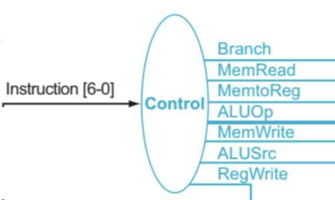
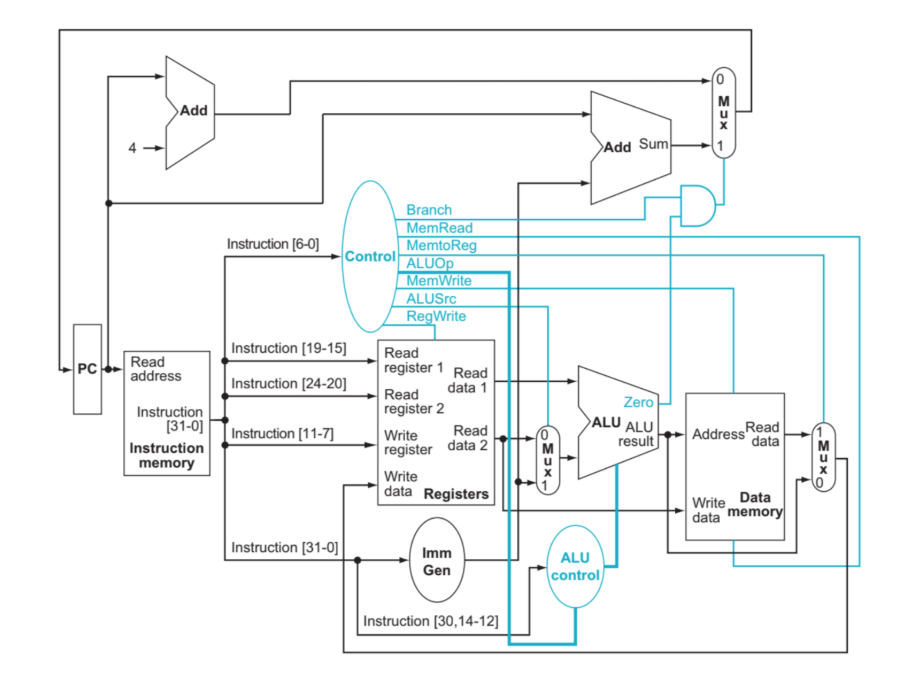
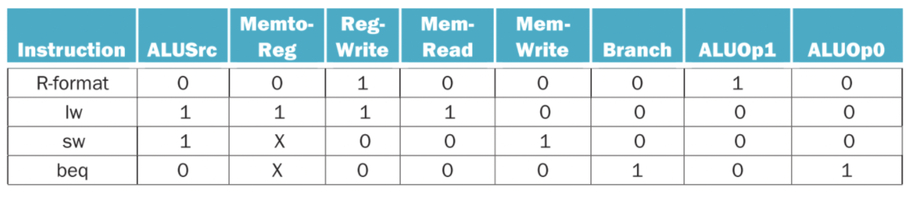
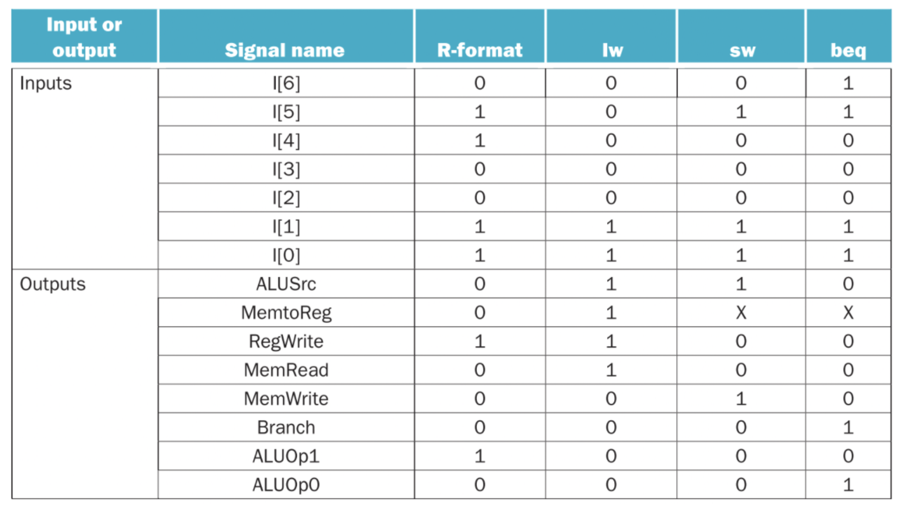

# Lab09 RISC-V Control
Today you will create verilog code and a testbench for the RISC-V control lines in the single-cycle processor.
Though the tables are given here for you, you will also want to understand why the control lines have the
values they do for each of the specific opcodes. You will need to design the control circuit in one verilog
module using behaviorial verilog, capture the schematic (there should be no registers or latches) and then 
write a testbench to determine if the circuit is correct.

Note that the circuit shown below is the same as the overall control in the single-cycle processor, and so
will be of use in a future project though NOT the ALU. This should give you some insight into how to design
the ALU control though.

## Submission
Submit a pdf with the following: 
1) (2 pts) the verilog module for your control module called `riscv_cntrl`
2) (2 pts) schematic generated by your verilog module
3) (2 pts) the testbench you are using to create a timing diagram
4) (2 pts) a timing diagram for an add, nop and a lw, showing the correct output
5) (2 pt) Answer the question(s) in the lab specification.

## The RISC-V main control lines
Take a few minutes to look at the block diagram of the main control lines in the single-cycle CPU. 
See if you can correlate the contents of the figure (zyBook Figure 8.4.10) with the table 
(zyBook Figure 8.4.11). With your partner think through the operation of an R-Format instruction
and a lw instruction, making sure the settings of the control lines make sense to you.

<!-- -->

## Considering how to include a nop instruction
For your design of the single-cycle CPU, the addition of a nop instruction and a halt instruction
will be useful. Note that on the back of your greensheet there is a psuedo-instruction for a nop.
It has the description of no operation R[0] = R[0] and indicates it uses addi. 

Q1: What will the specific instruction that implements a nop be? Explain why and if this
would require an additional case in the table above as well as in the more detailed table below.

## Write a Verilog module
Write a Verilog module called `riscv_cntrl` to implement the table above with the addition of
a nop instruction. Consider what the appropriate default instruction should be.

## Generate a schematic from your Verilog
Make sure that your schematic makes sense to you and does not include any extra latches
before you move on.

## Write a testbench for your module
Write a testbench to make sure your verilog produces the right output for at least
an add, nop, and a lw.

## Capture your timing diagram
It can be multiple pictures (one for each instruction) or one single picture as long
as it is readable in the write-up.

## Final question/reflection
Q2: How would you choose to implement a halt instruction for the single-cycle processor?
Would it require you to change your main control unit? Explain.

