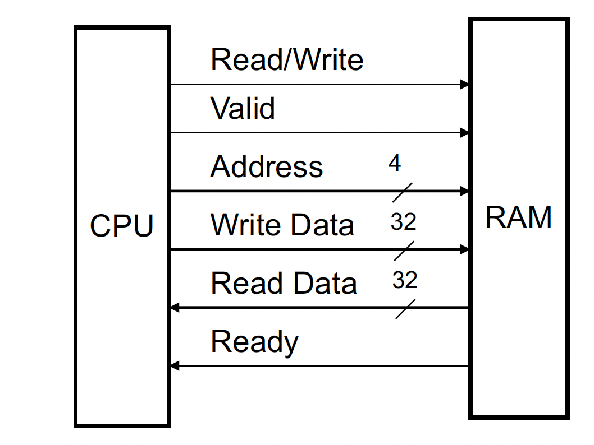

# Lab10 RAM with a handshake protocol
As demonstrated in a previous lab, RAM is a memory block accessed by
supplying an address to the RAM along with a write line and a clock signal. The data can either be written or read.
This data can be accessed by supplying an address to the RAM; after some time, the RAM will output the 
data stored at that address. Since a RAM can also be written to, the write will usually happens synchronously, 
when it is known the data is ready to be written as implemented in the single-cycle processor.

This RAM is designed differently. Instead of using a clock, it uses a handshake protocol to let the "CPU" or whatever
device is accessing it communicate timing. This makes it asynchronous. In this protocol, there is a 
Read/Write line that indicates the direction the data will flow in: read means a read of the RAM and 
so data will flow out, and write means write to the RAM so data will flow in. The protocol is such that when the
Read/Write line is high, indicating a write, the RAM waits for the Valid line to be high as well and then writes the 
data on the Write Data bus into the ram at the
location indicated by the Address bus. For a read, the Read/Write line will be low and once the Valid line indicates
the address is valid, the data from that location will be put on the Read Data bus and the Ready line asserted.
(Note: The Ready line only needs to be asserted for the read to occur.)

One could imagine that the Ready line could act as either an interrupt, or a memory location that could be polled to 
determine the value was available to be read. Here we are just reading a data value. That data value could in fact be
a control register for a device or the output of a device communicating with the CPU.

## Submission
Submit a pdf with the following: 
1) (2 pts) the verilog module for your asynchronous RAM
2) (2 pts) the testbench you are using to create a timing diagram
3) (4 pts) a timing diagram for a read, write, read to the RAM, showing the correct output
4) (10 pts) At some point during lab today, please bring me your suitcase with your PYNQ board and
   your combination lock for your team showing me all parts are still there. This will be a
   separate grade that will not be dropped in the project portion of your grade. Easy points!

## A Data Memory Circuit Design



## A Verilog Module
Note that a RAM is most easily organized as a two-dimensional net to make indexing easier. 

Syntax: `reg [M:0] <netname> [N:0]`

The above creates a net called `<netname>` and describes it as an array of (N+1) elements, where 
each element is a (M+1) bit number.

You should use the verilog module definition below to design your RAM.

```verilog
module ram (input rw, input valid, input [3:0] address, input [31:0] write_data, output reg [31:0] read_data, output reg ready); 

endmodule
```

## Happy Last Lab Day!
Hope you all have enjoyed getting to use the boards and learning this software!

